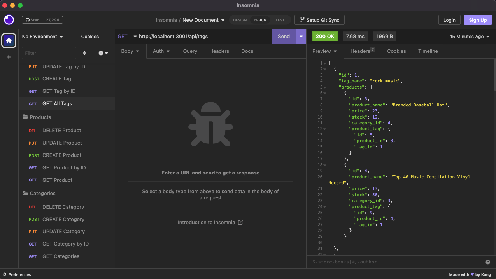

# E-Commerce Back End Code 
#### Aubrey Johnston
 

## Technologies Used
<ul>
    <li>Node</li>
    <li>MySQL</li>
    <li>Express</li>
    <li>Sequelize</li>
</ul>    

 

## Description
This application is designed to store information for an e-commerce company in a database and then, using api requests, return information in that database. My job in this project was to complete the back-end code, including the models and routes, to get the application to function as intended. 

 

 

## Installation
MySql (mysql2), Express, Sequelize, and other dependencies (ex. dotenv) must be installed before trying to run application. Clone code into local machine and make sure a .env file is included with the root user, database name, and MySQL password for application to run.
 

<link>

 

## Usage
 Make sure that all dependencies are installed. Then in the terminal, run 'npm start' and the application will start running on the localhost server. (a working '.env' file must be included in code for app to run) In Insomnia, users can test the routes for products, categories, and tags, and will find all of them returning functional results based on the request.

   
Watch the demo of how to use this application here:   
[E-commerce Back End Code Walkthrough](https://user-images.githubusercontent.com/116928146/228399221-879a247d-745f-4643-b5b5-0ca5a4b2ebb1.webm)

  
Screenshot of output from application:   

 
